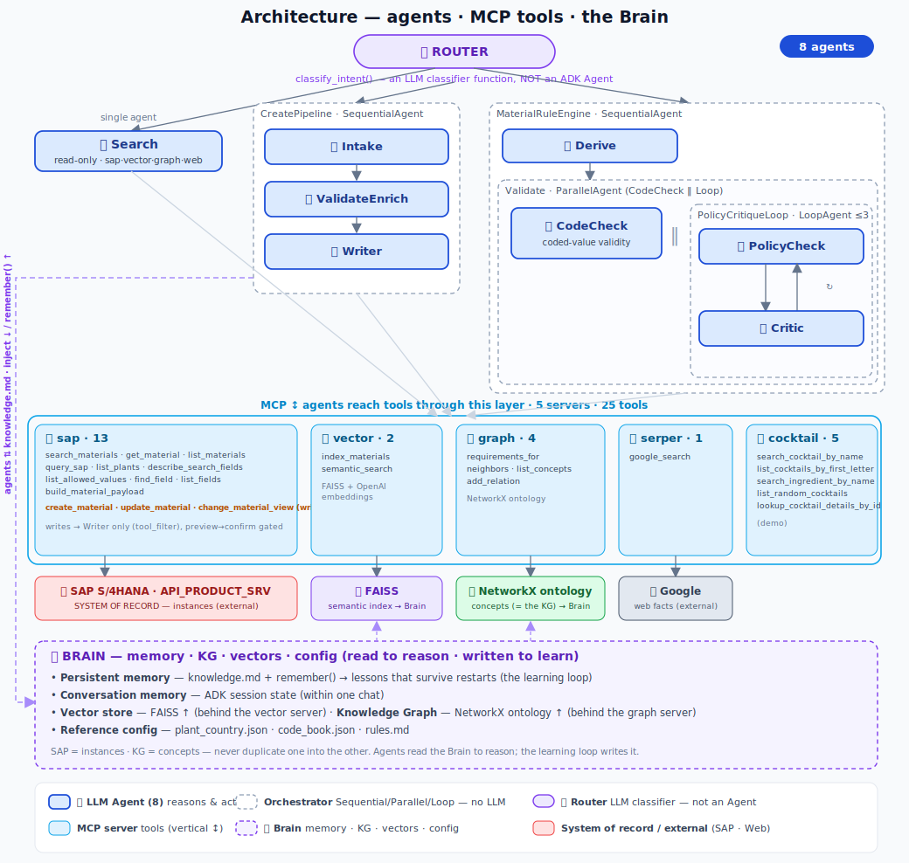
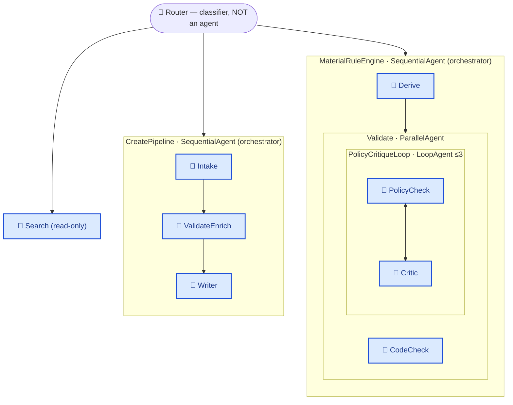

# Architecture — ADK · MCP SAP Material Assistant

A multimodal UI → an **intent router** → a small **team of specialist agents** → **MCP tools**
over (SAP system‑of‑record + a semantic index + a concept graph + the web), all sharing a
**learning memory**, fully **observable**.

## What is (and isn't) an agent

*Full view: **8 solid‑blue 🤖 agents** (they reason & act), **dashed orchestrators** that wrap them
(Sequential / Parallel / Loop — no LLM), the **🧭 router** (a classifier, *not* an agent), all
**5 MCP servers with their tools**, the backing **stores/systems**, and the cross‑cutting **🧠 Brain**
(memory · KG · vectors · config). The Mermaid below zooms into just the agent topology.*

| | What | LLM? | Count |
|---|---|---|---|
| **🤖 LLM agents** | Search · Intake · ValidateEnrich · Writer · Derive · CodeCheck · PolicyCheck · Critic | ✅ reasons & acts | **8** |
| **▢ Orchestrators** | CreatePipeline *(Sequential)* · MaterialRuleEngine *(Sequential)* · Validate *(Parallel)* · PolicyCritiqueLoop *(Loop)* | ❌ just arrange agents | 4 |
| **🧭 Router** | `classify_intent()` | an LLM *call*, but a function — **not an ADK Agent** | — |
| **Tools / data** | 5 MCP servers · SAP · FAISS · NetworkX · Web · the Brain | ❌ | — |

So the three "specialist" lanes are really: **1 agent** (Search) + **a 3-agent team** (Create/Change)
+ **a 4-agent team** (Rule Engine). The same topology in Mermaid (agents = solid, orchestrators =
dashed subgraphs):

Every agent reaches its capabilities **down** via MCP (the vertical axis) — that layer (which you
already know) is intentionally de-emphasized above.

## The two axes (the mental model)

| | Axis | What | Status |
|---|---|---|---|
| **MCP** | ↕ vertical | agent → tools / data | **built** |
| **A2A** | ↔ horizontal | agent ↔ agent | **designed, in-process** — ready to externalize |
| **Brain** | ⊕ cross-cutting | memory + KG + vectors | read to reason, written to learn |
| **SoR** | 🗄 | SAP = instances · KG = concepts | never duplicate one into the other |

## 🔌 MCP tools — the vertical axis
Five stdio MCP servers (`command=sys.executable`, so the subprocess always matches the app env):

| Server | # | Key tools |
|---|---|---|
| **sap** | 13 | search_materials, get_material, query_sap, list_plants, describe_search_fields, list_allowed_values, **find_field**, list_fields, build_material_payload, **create_material**, update_material, change_material_view |
| **vector** | 2 | index_materials, semantic_search (FAISS + OpenAI embeddings) |
| **graph** | 4 | requirements_for, neighbors, list_concepts, add_relation (NetworkX ontology) |
| **serper** | 1 | google_search |
| **cocktail** | 5 | demo |

Writes are confined to the **Writer** agent via `tool_filter` (Search + Validate are read-only),
and every write is **preview → confirm** gated.

## 🤝 A2A — the horizontal axis
The three specialists are dispatched **in-process** by the router today, so A2A isn't switched on —
but each specialist is a self-contained agent that could become a remote peer with an **Agent Card**
+ task endpoint. Splitting one onto another box/team/vendor turns that boundary into A2A; nothing
above or below it changes.

## 🧠 Memory — three timescales
- **Conversation** (ADK session state) — within one chat.
- **Persistent** (`knowledge.md` + `remember()`) — the **learning loop**; lessons survive restarts.
- **Vector store** (FAISS) — semantic recall by meaning.

Loop: *instruction (policy) → try → on error self-heal → on a confirmed fix `remember()` → next
session the lesson is pre-loaded.* High-value lessons get **promoted** from soft knowledge into hard
tool/code guards.

## 🕸 Knowledge Graph — concepts, not instances
The KG holds the **ontology** ("FERT *has* a Sales view; ROH *needs* a PIR") — never instances. SAP
stays the system of record for "material 11064 is in plant 1710." Agents **reason from the KG**, then
**act on SAP**.

## 📋 Observability
`run_with_trace` captures every agent/tool/arg/result → **Activity** panel; parsed structured output
→ **Data** panel; persisted to `logs/session_<id>.jsonl`.

## Component inventory
- **Agents (8 LLM):** Search · Intake · ValidateEnrich · Writer · Derive · CodeCheck · PolicyCheck · Critic.
- **Orchestrators (4):** SequentialAgent ×2 · ParallelAgent · LoopAgent.
- **Router:** `classify_intent()` (LLM classifier function, not an Agent).
- **MCP servers:** `mcp_server/{sap,vector,graph,serper,cocktail}.py`
- **Brain files:** `knowledge.py` + `knowledge.md`, `graph_store/ontology.json`, `vector_store/materials.faiss`, `plant_country.json`, `code_book.json`, `rules.md`
- **App:** `main.py` (router, multimodal, trace), `create_pipeline.py`, `validate_pipeline.py`, `rule_engine_glue.py`, `static/index.html`
